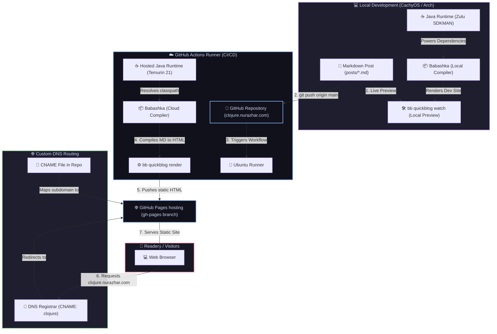

# clojure.nurazhar.com

> A lightweight, Babashka-native Clojure blog and digital garden dedicated to Lisp, shell scripting, and developer workflow automation.

This project is built using **[Quickblog](https://github.com/borkdude/quickblog)**, a fast static-site generator powered by **[Babashka](https://babashka.org/)**. It compiles plain Markdown files into highly optimized, static HTML with near-zero overhead.

---

## 🗺️ System Architecture

The following diagram illustrates the local development and automated CI/CD pipeline deployment to GitHub Pages under the custom domain `clojure.nurazhar.com`:



---

## 🛠️ Local Development & Quick Start

### Prerequisites
- **Babashka**: The Clojure scripting engine. Follow [Babashka installation](https://babashka.org/#installation).
- **Java Development Kit (JDK)**: Java 21+ is recommended (managed via `sdkman` or package manager).

### Running Locally
To start the live-reloading local development server:
```bash
bb quickblog watch
```
This runs a local HTTP server at `http://localhost:1888` which automatically re-renders pages as you modify markdown files in the `posts/` directory.

### Available Tasks
The project tasks are structured via Babashka `bb.edn`:
*   `bb quickblog new` – Generate a template for a new blog post.
*   `bb quickblog render` – Compile all Markdown files in `posts/` into static HTML.
*   `bb quickblog watch` – Start the local dev server with auto-refresh.
*   `bb quickblog clean` – Clean the output directories.
*   `bb quickblog help` – Display help regarding Quickblog CLI options.

---

## 🚀 CI/CD Pipeline

Deployment is fully automated using GitHub Actions (`.github/workflows/deploy.yml`):
1. On every `git push` to the `main` branch, the pipeline is triggered.
2. It sets up **Java 21** (Temurin distribution) and installs **Babashka**.
3. Compiles the markdown posts using `bb quickblog render` into the `public/` directory.
4. Deploys the generated output to the `gh-pages` branch using the `peaceiris/actions-gh-pages` action, configured for the custom domain `clojure.nurazhar.com`.
