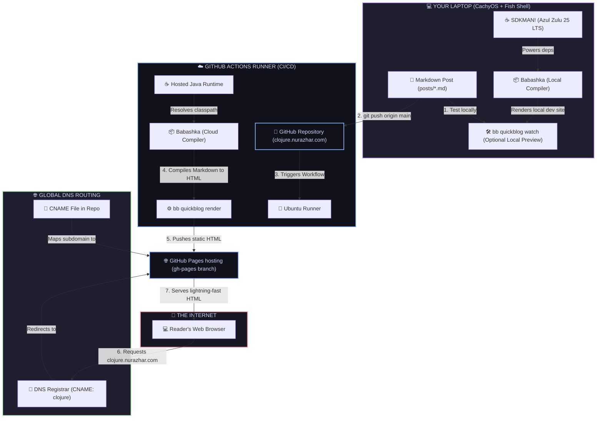

# clojure.nurazhar.com - System Architecture

This document maps out the system architecture and deployment pipeline for your Babashka-native Clojure blog.

---

## 🗺️ Visual Architecture Diagram

---

## ⚙️ Component Details

### 1. Local Laptop Setup
*   **Path:** `/home/nurazhar/Documents/1_identity_&_career/clojure.nurazhar.com/`
*   **Java Runtime:** Azul Zulu 25 LTS (`25.0.3-zulu`) managed in user-space via **SDKMAN!**.
*   **Interactive Tool:** Babashka (`bb`) runs local tasks without JVM startup overhead.
*   **Local Preview:** Running `bb quickblog watch` mounts a live-reloading HTTP server at `http://localhost:1888` for instant local proofing.

### 2. GitHub Actions CI/CD Pipeline
*   **Trigger:** Triggers automatically on every `git push` to the `main` branch.
*   **Runner Environment:** Standard `ubuntu-latest` running the **Adoptium Java 25 (LTS)** action and **DeLaGuardo/setup-clojure** action.
*   **Compilation:** Invokes `bb quickblog render` in the cloud to resolve dependencies and translate Markdown into standard, high-performance static HTML.

### 3. GitHub Pages & DNS
*   **Hosting Source:** Deploys from the compiled `public/` folder directly to the `gh-pages` branch.
*   **CNAME Mapping:** The `CNAME` file instructs GitHub to associate the build output with the custom subdomain `clojure.nurazhar.com`.
*   **External Routing:** Your global DNS registrar routes requests for `clojure` to `nurazharSG.github.io`, pointing users to the live server.
