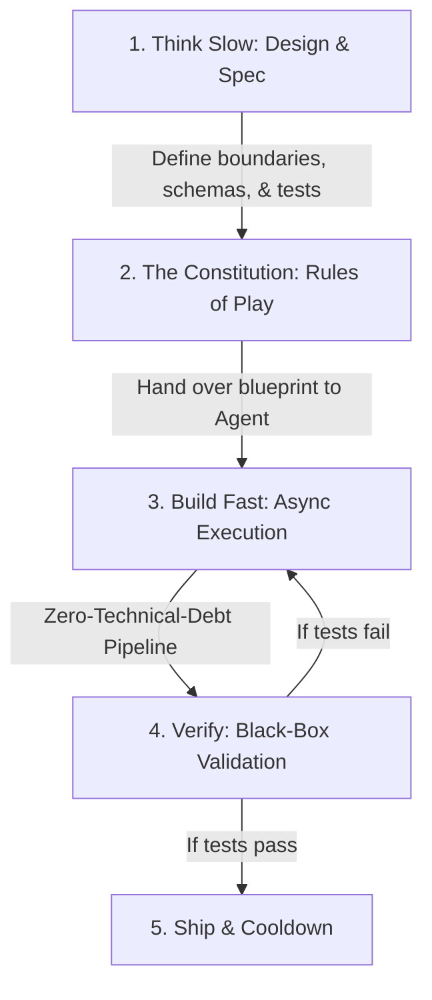

Title: AI-First SDLC: Designing for High Velocity and Cognitive Vertigo
Date: 2026-06-14
Tags: architecture, workflow, developer-experience, automation
Description: An engineering guide to the AI-First Software Development Lifecycle (SDLC). Learn how to structure agent interactions, build validation boundaries, and survive the literal cognitive fatigue of developing at warp speed.

---

If you use autonomous coding agents for more than a few hours, you will hit a wall. 

It is a silent, exhausting kind of fatigue. You didn’t write a single line of boilerplate, you didn't fight compiler configurations, and you didn't search documentation. Yet, your head is throbbing, you feel dizzy, and your mental stamina is completely shot. 

This is **Cognitive Vertigo (or Cognitive G-Force)**. It is caused by the collapse of latency between *intent* and *execution*. When you are no longer limited by typing speed, your brain is forced into a continuous loop of high-frequency architecture evaluation, context-switching, and code review. 

To survive a full-time role in this new era without burning out, you must discard the traditional developer workflow and adopt an **AI-First Software Development Lifecycle (SDLC)**.

---

## The Paradigm Shift: Think Slow, Build Fast

In the traditional SDLC, developers spend 80% of their energy coding and 20% designing. When coding, your brain operates in a slow, sequential state. 

In an AI-First SDLC, this relationship is inverted:

```mermaid
gantt
    title Traditional vs. AI-First Developer Lifecycles
    dateFormat  X
    axisFormat %s
    
    section Traditional SDLC (Active Typing)
    Design (Slow)          :active, des1, 0, 20
    Coding & Debugging (Grind)  :active, cod1, 20, 100
    
    section AI-First SDLC (Agent Orchestration)
    Spec & Architecture (80% Brain)  :crit, des2, 0, 80
    Agent Execution & Tests (20% Verify) :crit, cod2, 80, 100
```

By separating the **Design Phase** (Think Slow) from the **Execution Phase** (Build Fast), you shield your brain from the constant feedback loops that drain your mental battery.

---

## Core Pillars of the AI-First SDLC

Drawing inspiration from structured frameworks like **[SteveGJones/ai-first-sdlc-practices](https://github.com/SteveGJones/ai-first-sdlc-practices)**, here is the blueprint to structure your day-to-day workflow for maximum stamina:

### 1. The Constitution (Declarative Rules)
Do not explain your design philosophy to an agent in every chat. Define a permanent configuration file (like a `CONSTITUTION.md` or `.clauderc`) in your repository root. This constitution outlines:
* Strict coding style and directory hierarchies.
* Error-handling patterns.
* Mandatory unit test structures.
* Zero-technical-debt boundaries.

By encoding your architectural standards in a file, the agent reads them as a system constraint. You no longer need to waste energy correcting style errors.

### 2. Pipeline Validation (`validate --syntax/--quick/--pre-push`)
Stop reading code line-by-line to verify correctness. This is a primary driver of cognitive fatigue. Instead, implement a multi-stage validation script in your workspace:
* **`validate --syntax`**: Evaluates basic file structures and imports immediately after generation.
* **`validate --quick`**: Runs fast unit tests and linter audits before commits are written.
* **`validate --pre-push`**: Executes the full integration test suite and scans for security anomalies.

If the validation script passes, trust the implementation. Focus your energy on verifying the boundaries, not inspecting the lines.

### 3. Asynchronous Execution (The Pacing Rule)
Pair-programming with an agent in real-time is a cognitive trap. Instead, delegate asynchronously:
1. **Write the Specification:** Explicitly define the goal, the affected files, and the expected unit test changes in a task file (`task.md` or `implementation_plan.md`).
2. **Launch the Agent:** Tell the agent to execute the specification and output its results.
3. **Step Away:** Physically leave your keyboard. Walk around, drink water, or look out a window. Let the agent compile, write, and run tests in its own sandbox.
4. **Evaluate the Artifacts:** Return only when the agent has completed the task and updated its walkthrough document.

---

## Daily Habits to Collapse Cognitive Fatigue to Zero

Bookmark this checklist and use it as your daily operating system:

| Habit | How to Implement | Why it Saves Your Brain |
| :--- | :--- | :--- |
| **Zero-Cache Brain** | Write all active tasks in a physical notepad or `task.md`. Never hold stack frames in your head. | Frees up working memory. |
| **Test-Driven Intent** | Write the tests or output schemas first. Let the agent code until the tests pass. | Eliminates the need for line-by-line review. |
| **Paced Breaks** | Set a timer to step away from the IDE for 5 minutes after every major agent execution. | Prevents cognitive overheating. |
| **Interface Design** | Spend your time writing HoneySQL configurations, Malli schemas, or API signatures. | Keeps your brain in the "System Architect" tier. |

---

*The speed of development is no longer bound by syntax. It is bound by your mental endurance. Structure your workflow to protect your mind first.*
