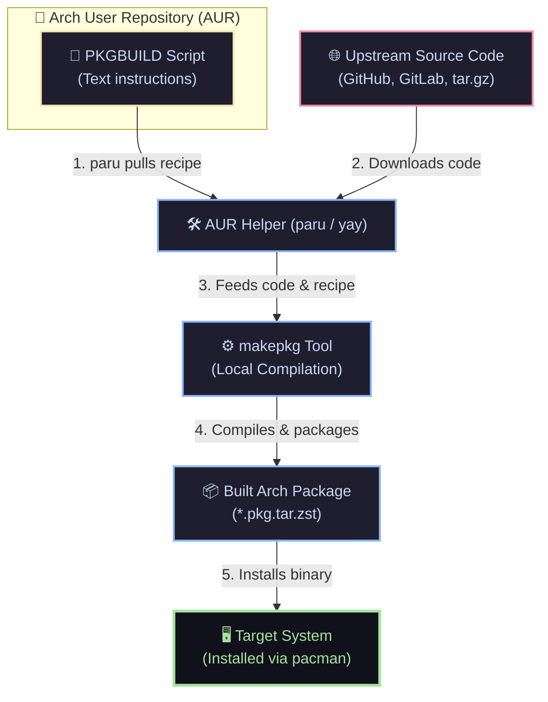

Title: Demystifying Arch Linux Packaging: PKGBUILDs, the AUR, and CachyOS
Date: 2026-06-14
Tags: archlinux, cachyos, devops, packaging
Description: A deep dive into how packages are built, shared, and optimized on Arch Linux and CachyOS. Learn the differences between PKGBUILDs, the AUR, and custom repositories.

---

Arch Linux and its performance-optimized sibling, CachyOS, have one of the most powerful and elegant packaging systems in the entire Linux ecosystem. However, for newcomers and developers transitioning from other distributions, concepts like **PKGBUILDs**, the **AUR**, **AUR helpers** (like `paru`/`yay`), and **custom repository forks** can quickly become confusing.

If you have ever wondered:
* *Is the AUR just full of binary files?*
* *Why does CachyOS maintain its own custom PKGBUILD repository instead of using the AUR?*
* *What is the actual step-by-step lifecycle of code turning into an installed package?*

This guide breaks it down with clear diagrams, comparisons, and technical details.

---

## 🍳 The Cooking Analogy

To understand this system, let's look at a quick analogy:

* **Source Code** is the **raw ingredients** (vegetables, meat, spices) sitting on a farm (GitHub/GitLab).
* **A PKGBUILD** is the **recipe**. It tells you exactly how to prepare the ingredients, what pots to use, and how long to cook them.
* **The AUR (Arch User Repository)** is a **public recipe-sharing website**. Anyone can upload a recipe here.
* **The Built Package** is the **cooked meal** (e.g., a `.pkg.tar.zst` file). This is what you actually consume (install).
* **An AUR Helper (like `paru`)** is your **automated personal chef**. It visits the recipe site, fetches the instructions, downloads the ingredients, cooks it, and serves it to you.

---

## 🗺️ The Arch Package Lifecycle

Here is how source code on the internet eventually becomes a running application on your machine:



---

## 🔍 Deep Dive: PKGBUILD vs. AUR vs. CachyOS

### 1. What is a PKGBUILD?
A `PKGBUILD` is a plain-text shell script containing variables and functions (like `prepare()`, `build()`, and `package()`). 

Here is a simplified look at what a `PKGBUILD` does:
```bash
pkgname=freebuff-bin
pkgver=0.0.106
arch=('x86_64')
depends=('glibc')

source=("https://github.com/CodebuffAI/codebuff/releases/download/v${pkgver}/freebuff-linux")

package() {
    # Install the precompiled binary into the system binary path
    install -Dm755 "${srcdir}/freebuff-linux" "${pkgdir}/usr/bin/freebuff"
}
```

### 2. Is the AUR Full of Binary Files?
**No.** The AUR website only hosts **text-based PKGBUILD scripts** (along with occasional helper configuration files). It does not store `.exe`, `.bin`, or `.pkg.tar.zst` packages.

However, some package names on the AUR end with `-bin` (e.g., `freebuff-bin`). This is a naming convention:
* **`freebuff` (Source package)**: The PKGBUILD downloads the raw C/Rust/Go source code, compiles it on your machine (which can take minutes or hours), and packages the result.
* **`freebuff-bin` (Binary package)**: The PKGBUILD skips compilation by downloading a pre-built binary compiled by the original developers (e.g., from their GitHub Releases page) and packages it instantly.

### 3. Why does CachyOS maintain its own PKGBUILD repository?
CachyOS is a downstream distribution focused on squeezing out every drop of performance from modern hardware. Instead of fetching generic packages from Arch Linux or compilation scripts from the AUR, they maintain a fork called `CachyOS-PKGBUILDS`. 

They do this to implement three key enhancements:

1. **Instruction Set Architecture (ISA) Optimization**:
   Standard Arch Linux packages are built for generic `x86-64` CPUs (compatible with older computers). CachyOS rebuilds these packages targeting **x86-64-v3** (which requires AVX2) and **x86-64-v4** (AVX-512). This makes CPU-bound software significantly faster.
2. **Custom Performance Patches**:
   CachyOS injects patches directly into their PKGBUILDs—such as customized kernel patches (`linux-cachyos`), CPU scheduler configurations (`scx` for sched-ext), and custom compiler flags (`-O3`, LTO).
3. **Stability & Mirrors**:
   By compiling their own PKGBUILDs on dedicated build servers, CachyOS hosts pre-compiled, optimized binaries on their official package mirrors. This gives users optimized software without forcing them to spend hours compiling it locally.

---

## 🌎 Comparison with Traditional Distributions (Debian & Red Hat)

If you are coming from a Debian-based (Ubuntu, Mint) or Red Hat-based (Fedora, RHEL) background, the Arch approach feels very different. Traditional distributions handle packaging and third-party software using different philosophies:

### 1. Debian / Ubuntu (Apt & `.deb`)
* **How they distribute**: Pre-compiled binaries (`.deb` files) hosted in large central repositories.
* **Third-Party / Community Apps**: Instead of a single repository for community recipes, Debian/Ubuntu uses **PPAs (Personal Package Archives)**. A PPA is a separate hosted repository of actual pre-compiled binary packages.
* **Building Packages**: Creating a `.deb` package requires a complex file structure (including a `debian/control` file, `debian/rules` file, etc.) and utilities like `dpkg-buildpackage`. It is significantly more difficult to write than a single `PKGBUILD` script.

### 2. Red Hat / Fedora (DNF & `.rpm`)
* **How they distribute**: Pre-compiled binaries (`.rpm` files).
* **Third-Party / Community Apps**: Fedora uses **COPR** (Cool Other Package Repo), similar to Ubuntu's PPAs. It hosts pre-compiled binaries built by users on Red Hat’s servers.
* **Building Packages**: Creating an `.rpm` package requires writing an RPM `.spec` file. While structured, spec files are notoriously verbose and complex compared to the clean, Bash-like syntax of `PKGBUILD`s.

### Summary of Differences

* **Source vs. Binary Community Repos**: The **AUR** distributes **scripts** (you compile locally). **PPAs & COPR** distribute **pre-compiled binaries** (compiled on canonical servers and downloaded directly).
* **Simplicity**: Arch's `PKGBUILD` is a single, readable Bash script. Debian and Red Hat packages require complex build directories and specialized spec/rule syntaxes.
* **Optimization**: Debian and RHEL prioritize stability and compatibility, targeting generic, older `x86-64` hardware. CachyOS rebuilds everything specifically to leverage modern CPU instructions.

### Visual Comparison: AUR vs. PPA/COPR Build Models

```mermaid
flowchart TD
    %% Custom Styling
    classDef arch fill:#1e1e2e,stroke:#89b4fa,stroke-width:2px,color:#cdd6f4;
    classDef debian fill:#1e1e2e,stroke:#f38ba8,stroke-width:2px,color:#cdd6f4;
    classDef compile fill:#1e1e2e,stroke:#f9e2af,stroke-width:2px,color:#cdd6f4;
    classDef system fill:#11111b,stroke:#a6e3a1,stroke-width:3px,color:#cdd6f4;

    subgraph Arch_Model ["Arch Linux (AUR) Model"]
        A1["📄 AUR Server<br/>(Hosts PKGBUILD Script)"]:::arch
        A2["🌐 Upstream Source Code<br/>(GitHub / Tarball)"]:::arch
        A3["⚙️ User's Machine<br/>(Compiles & Packages)"]:::compile
        A4["🖥️ Installed Program"]:::system

        A1 -->|1. Downloads script| A3
        A2 -->|2. Downloads code| A3
        A3 -->|3. Install package| A4
    end

    subgraph Debian_RedHat_Model ["Debian (PPA) / RedHat (COPR) Model"]
        B1["📄 Recipe / Spec File"]:::debian
        B2["🌐 Upstream Source Code"]:::debian
        B3["☁️ Build Servers<br/>(Canonical/RedHat Cloud)"]:::compile
        B4["📦 Hosted Binary Repository<br/>(.deb / .rpm)"]:::debian
        B5["⚙️ User's Machine<br/>(Apt / DNF Download)"]:::compile
        B6["🖥️ Installed Program"]:::system

        B1 -->|1. Build trigger| B3
        B2 -->|2. Upload code| B3
        B3 -->|3. Compile & store| B4
        B4 -->|4. Download binary| B5
        B5 -->|5. Install| B6
    end
```



---

## 📊 Comparison Table

| Feature | Upstream Code / Release | PKGBUILD Script | AUR (Arch User Repo) | CachyOS PKGBUILD Repo |
| :--- | :--- | :--- | :--- | :--- |
| **What is it?** | Raw application source code or generic binary releases. | A text file containing build instructions. | A community directory of PKGBUILD scripts. | A curated collection of CachyOS-specific PKGBUILDs. |
| **Host Location** | GitHub, GitLab, official websites. | Local filesystem (e.g., `/tmp`). | `aur.archlinux.org` | `github.com/CachyOS/CachyOS-PKGBUILDS` |
| **Content Type** | `.tar.gz`, `.zip`, `.rs`, `.cpp`, `.go` | Plain text shell script (`bash` syntax). | Git repositories containing only PKGBUILD files. | Git repository containing CachyOS package build scripts. |
| **Compilation** | N/A (unbuilt source). | Happens when you run `makepkg` on it. | User compiles it locally (unless it's a `-bin` package). | Pre-compiled on CachyOS servers; distributed via pacman mirrors. |
| **Optimizations** | Generic. | Up to the user's local configuration. | Generic. | Highly optimized (AVX2, AVX-512, `-O3`, LTO). |

---

## 🛠️ Practical Takeaway

When you want to run new software like **Freebuff** (a terminal-based AI coding assistant):
* You check if it is in the official repositories or `CachyOS-PKGBUILDS`.
* If it isn't, you use an AUR helper like `paru` (e.g., `paru -S freebuff-bin`).
* `paru` reads the recipe from the AUR, downloads the binary release from upstream, and installs it cleanly on your system.
