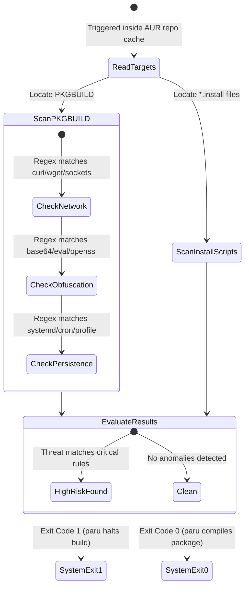

Title: Hardening the Arch/CachyOS Build Pipeline: Native AUR Auditing with Paru & Babashka
Date: 2026-06-14
Tags: security, linux, archlinux, devops, systems
Description: A visual reference guide to native PreBuild hooks. We configure paru to automatically run our Clojure-based aur-audit scanner before compiling community packages.

---

When updating an Arch-based system (like CachyOS) via AUR helpers, we are executing arbitrary build scripts (`PKGBUILD` and `.install` scripts) written by community members. During supply chain incidents, relying on manual human checks is a massive liability.

This post serves as a high-signal reference to automate static analysis on these scripts natively before compilation.

---

### The Architecture: Before vs. After

```mermaid
graph TD
    subgraph Legacy Workflow [Risky: Before aur-audit]
        A1[paru install google-chrome] --> A2[Fetch AUR Git Repository]
        A2 --> A3[Human Review / Pager]
        A3 -->|User presses q / confirms| A4[Execute PKGBUILD / makepkg]
        A4 -->|Malicious code runs on host| A5[System Compromised]
    end

    subgraph Secure Workflow [Hardened: After aur-audit]
        B1[paru install google-chrome] --> B2[Fetch AUR Git Repository]
        B2 --> B3[Trigger: PreBuildCommand]
        B3 --> B4{aur-audit.clj Scan}
        B4 -->|Exit Code: 1 / Threat Found| B5[Abort Build & Halt execution]
        B4 -->|Exit Code: 0 / Clean| B6[Execute PKGBUILD / makepkg]
        B6 --> B7[Secure Installation]
    end
    
    style A5 fill:#f38ba8,stroke:#111,stroke-width:2px,color:#111
    style B5 fill:#f9e2af,stroke:#111,stroke-width:2px,color:#111
    style B7 fill:#a6e3a1,stroke:#111,stroke-width:2px,color:#111
```



---

### Security Execution Matrix

| Metric | Before Integration | After Integration |
| :--- | :--- | :--- |
| **Verification Gate** | Manual scrolling (Human eye) | Automated regex parser + human backup |
| **Halt Condition** | User notices anomaly and presses Ctrl+C | Exit Code `1` from `PreBuildCommand` kills loop |
| **Verification Speed** | Slow, prone to fatigue | Instant (Milliseconds via Babashka) |
| **Audit Scope** | Only files shown in the pager | Deep scan of both `PKGBUILD` and `.install` scripts |
| **Vulnerability Signatures** | None | Scans for curl/wget payloads, systemd persistence, profile injections |

---

### System Integration Commands

To configure this setup, we link our scanner to our local userspace path and hook it directly into `paru`'s execution engine.

#### 1. Symlink and Make Executable
We place the compiler/script within our local userspace bin directory:

```fish
ln -sf /home/nurazhar/Documents/Bugs/aur-audit/aur-audit.clj $HOME/.local/bin/aur-audit
chmod +x $HOME/.local/bin/aur-audit
```

#### 2. Native Paru Hook configuration
Append the pre-build trigger configuration to your local `paru.conf` file:

```ini
# ~/.config/paru/paru.conf
[options]
PreBuildCommand = /home/nurazhar/.local/bin/aur-audit
```

---

### Threat Scanner Flow

Whenever a build begins, the pre-build phase executes the following logic inside the package source directory:



With this integration, you establish a system-enforced defense gate that eliminates cognitive fatigue during package upgrades.
