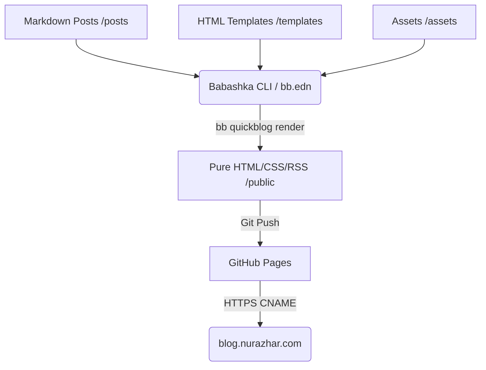

Title: Quickblog: The Zen of Minimalist Static Site Generation
Date: 2026-06-14
Tags: clojure, babashka, architecture, simplicity
Description: An architectural breakdown of Quickblog, the minimalist static site generator powered by Babashka, and why zero-database static HTML is the ultimate design choice.

---

# Quickblog: The Zen of Minimalist Static Site Generation

When building a personal blog, modern web development defaults to overkill. Setting up dynamic frameworks (like Next.js, Remix, or MERN stacks) with backend databases, authentication layers, and real-time APIs introduces a massive maintenance burden, security attack surface, and slow page-load times.

For a blog, **static HTML is the ultimate architecture**. This blog is powered by **[Quickblog](https://github.com/borkdude/quickblog)**, a lightweight static site generator designed for the Clojure/Babashka ecosystem by Michiel Borkent (@borkdude).

Here is a breakdown of how it works under the hood and why this architecture is a superior design choice.

---

## 1. The Core Runtime: Babashka

At the heart of Quickblog is **[Babashka](https://babashka.org/)**, a fast-starting scripting runtime for Clojure. 

Traditional Clojure runs on the JVM, which is powerful but suffers from a slow startup time (often several seconds)—making it tedious for quick CLI utilities and scripts. Babashka solves this by using GraalVM to compile the Clojure interpreter into a native binary. This gives us:
- **Instant startup** (measured in milliseconds).
- **Zero JVM overhead** on the host.
- A rich subset of Clojure libraries (like shell execution, filesystem navigation, and HTTP client/server) pre-baked into the runtime.

Quickblog is executed entirely as a Babashka task defined in `bb.edn`.

---

## 2. Compilation Flow

Quickblog's architecture follows a clean, functional pipeline:

1. **Ingestion**: It reads raw Markdown files from the `/posts` directory and reads configuration parameters from `bb.edn`.
2. **Metadata Parsing**: It extracts frontmatter metadata (Title, Date, Tags, Description) from the top of each Markdown file.
3. **HTML Transformation**: Using Clojure-based parsing engines, it transforms Markdown syntax into clean HTML.
4. **Templating**: It uses **[Selmer](https://github.com/yogthos/Selmer)** (a Django-like templating library written in Clojure) to wrap the rendered Markdown inside your main HTML layout (`/templates/base.html`, `/templates/post.html`, etc.).
5. **Feed & Index Generation**: It automatically aggregates posts sorted by date to generate:
   - `index.html` (the homepage loading up to $N$ posts).
   - `archive.html` (a list of all posts).
   - `tags.html` (filtered views).
   - `feed.xml` (RSS feed).
6. **Output**: All static resources are placed into a single `/public` directory, ready to be hosted anywhere.

---

## 3. Why This Design is Superior (The Pros)

- **Zero-Database Security**: No dynamic database queries mean **zero SQL injection, zero Server-Side Request Forgery (SSRF), and zero database connection exhaustion**.
- **Extreme Performance**: Static HTML files are served directly by the web server (GitHub Pages / Nginx / Cloudflare) at edge speeds. The browser parses only clean HTML and CSS, rendering instantly.
- **Low Footprint**: No background servers running on Node.js or Python, minimizing CPU/Memory usage.
- **Git as the Single Source of Truth**: Posts are stored as plain text version-controlled files. Moving, backing up, or editing posts is as simple as running standard Git commands.

---

## Conclusion: Emulating Satoshi's Design Philosophy

In his original 2008 Bitcoin v0.1 release, Satoshi Nakamoto focused on **peer-to-peer simplicity**—designing a system with direct nodes, no unnecessary intermediate layers, and raw efficiency. 

Quickblog mirrors this philosophy in web development. By stripping away heavy JS frameworks, hydrations, client-side state managers, and database servers, it leaves you with exactly what the web was built for: **clean, readable, and immortal HTML**.
