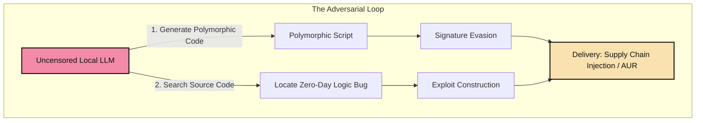
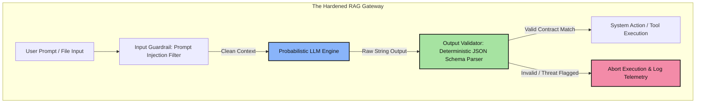

Title: Red Teaming AI Pipelines: How Attackers Weaponize LLMs & How to Build Defensive Harnesses
Date: 2026-06-14
Tags: security, ai, llm, red-teaming, architecture
Description: A deep dive into how threat actors use large language models for vulnerability generation and polymorphic evasion, and how security engineers construct automated test harnesses to mitigate agentic risk.

---

In the landscape of AI security engineering, the threat model has shifted. We are no longer just securing static databases; we are securing **dynamic, probabilistic execution runtimes (LLMs & Autonomous Agents)**. 

To land roles in AI Security Engineering (such as at leading digital asset platforms), an engineer must understand both sides of the coin: **how attackers weaponize LLMs** and **how to construct deterministic defensive verification gates**.

Here is the structural blueprint of AI-driven threat generation and the architectural frameworks required to defend them.

---

### The Threat Model: How Attackers Leverage LLMs

Attackers use LLMs as automated, force-multiplying compilation engines rather than simple query-answering bots.



#### 1. Polymorphic Payload Generation
Traditional security systems look for static indicators of compromise (hashes or signature strings). Attackers use local, fine-tuned LLMs to rewrite the syntax of malicious shell scripts dynamically on every download. 
* By changing variable naming structures, altering execution pathways, and obfuscating payloads (e.g., swapping standard calls for dynamically computed base64 evaluation hooks), the malware performs the exact same function but completely evades signature-based static detection.

#### 2. Automated Vulnerability Auditing (Targeting Zero-Days)
State-sponsored groups feed massive codebases (such as open-source libraries or OS modules) into automated agent pipelines. These agents are programmed to trace variable bounds, look for memory leaks, and identify injection points, generating functional exploit payloads at scale.

---

### The Defensive Architecture: Constructing the Test Harness

To secure LLM integrations and agentic workflows, we must treat the probabilistic model output as an **untrusted process**. We apply classic sandboxing and input/output contract boundaries.



#### The Core Security Principles

| Risk Vector | Threat Mechanics | Defensive Mitigation (The Test Harness) |
| :--- | :--- | :--- |
| **Prompt Injection** | Adversarial inputs tricking the model to ignore system prompt rules. | **Context Isolation**: Separating system instructions from untrusted user data via clear boundary delimiters. |
| **Insecure Tool Use** | Agents executing commands natively (e.g., executing raw bash strings). | **Deterministic JSON Contracts**: Forcing the model to output *only* strict JSON schemas that map to safe, pre-validated parameters. |
| **Data Leakage** | Parametric memory containing PII/keys exposing data during queries. | **RAG Filter layers**: Running localized regex/entity extraction on context before it is loaded into the LLM context window. |

---

### Practical Implementation: Building the Audit Gateway

In a secure Software Development Life Cycle (SDLC) that adopts AI automation, the security engineer builds **repeatable validation engines**. 

For example, when auditing third-party code packages or automated agent outputs, we execute static analysis rules targeting privilege escalation risks:

```clojure
;; Example signature check inside an automated Clojure/Babashka harness:
(def security-rules
  [{:id "NET-01" :level :critical :desc "Outbound payload downloads" :regex #"(?i)\b(curl|wget)\b"}
   {:id "PERS-01" :level :high :desc "Persistence hooks" :regex #"(?i)(/etc/systemd/system|/etc/cron)"}])
```

By placing these automated validations directly inside developer pipelines (like Git pre-commit hooks or packaging environments), we prevent compromised scripts or corrupted AI actions from executing on the host workstation. 

### Bridging the Gap: AI Security as an Infrastructure Challenge
Ultimately, securing AI is not about changing the weights of the model; it is about **designing the security infrastructure around it**. By wrapping AI runtimes in isolated execution boundaries, validating outputs with deterministic contracts, and auditing inputs before they reach the context window, we ensure agentic automation remains secure and reliable.
